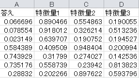

# mlcalculator
クリックだけで機械学習をしよう。というテーマで開発したアプリ  
docker, docker-composeがあれば動く
# コンテンツ
1. [前置き](#1-前置き)
2. [使う為の準備](#2-使う為の準備)  
2.1. githubからコードをダウンロードする  
2.2. 使ってみたいデータの準備と整形
3. [使い方](#3-使い方)  
3.1. 使用するモデルを選択する  
3.2. 使用するデータを選択する  
3.3. 計算の条件を確認する  
3.4. 結果を確認する
## 1. 前置き
***
職場で機械学習を使って何かしようとか、使って何かしてもらおうと思った時、統計の勉強やpython コードを書く事に抵抗がある人が多かった。そこで、勉強0、コード0、無料で使える(出来れば本番運用まで)、アプリがあると便利と感じていた。  
そこで、このアプリを、webアプリ開発の練習がてらpython + django で作ってみた。  
__クリックだけで機械学習を試す、がテーマ。__
## 2. 使う為の準備
***
最低限アプリを動かす為の説明。  
基本的には、コードのダウンロードとデータの準備のみ。
### 2.1. githubからコードをダウンロードする
***
ポートの80と8000が使用中でないか、確認しておく。  
git clone でコードをダウンロードし、ディレクトリを移動する。  
*linux系端末では、dbinit.shに権限を付与しないと動かない事が確認されてます。
~~~
git clone https://github.com/msamunetogetoge/mlcalculator.git
cd mlcalculator
chmod +x dbinit.sh  
~~~ 
### 2.2. 使ってみたいデータの準備と整形
データはcsv形式のみ。  
以下の画像のように、1列目に予測したい量、2列目以降に数字の特徴量を並べた形にのみ対応している。  
`temp_hmdt.csv`というファイルがあるので、それで試せる。  
  
## 3 使い方
***
コンテナを起動すれば使える。(docker, docker-composeがインストールされている必要がある。)
~~~
docker-compose up -d  
~~~
でコンテナ起動後、`http://localhost` にアクセスすると使える。  
### 3.1. 使用するモデルを選択する
やってみたい事に合わせて使用するモデルを選ぶ。現在使えるモデルは以下の通り。  
- 回帰  
- ロジスティック回帰  
- ニューラルネットワーク   

やりたい事と、モデルの対応は以下。  
|やりたい事|モデル|
|---|---|
|数字の予測|回帰, ニューラルネットワーク|
|分類|ロジスティック回帰, ニューラルネットワーク|

モデルを選んだら送信ボタンをクリックする。  
   
### 3.2. 使用するデータを選択する
使用するデータをアップロードする。  
アップロードされたデータはgit clone で作られたディレクトリ内、`mlcalculator/media`に保存されています。
データを選択し、選択ボタンをクリックする。   
ニューラルネットワークの場合は、層の深さは固定で、ノードの数を手動で決める。 
  
### 3.3. 計算の条件を確認する
計算の条件が望みどおりになっていたら、計算ボタンを押す。
  
### 3.4. 結果を確認する
結果を確認する。  
使った損失関数や、その値、簡単な説明が表示される。  
もしも必要なら、結果のダウンロードボタンをクリックして予測結果が入ったcsvファイルをダウンロードできる。
  
# 更新履歴
2020/9/13 回帰分析だけ出来るバージョンを公開  
2020/9/18 ロジスティック回帰も出来るバージョンを公開。ヘルプページも追加。    
2020/9/28 Material-kit を使用してみた目を整えた。  
2020/10/5 NNを使えるようにした。  
2020/10/13 テストを書き、github actionでpush毎に実行されるようにした。  
2020/10/19 docker image にする用のdocker file を置いた。  
2020/10/23 nginx + gunicorn で動くようにdockerfile などを編集した。  
